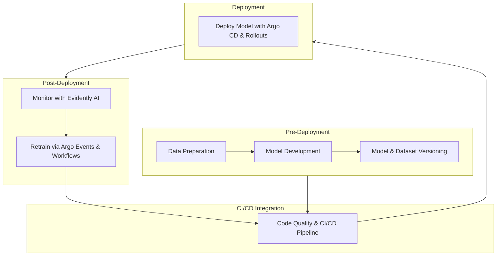

# **MLOps Demo: Automated ML Pipelines with GitOps Principles**  

## **Overview**  
This project demonstrates how to set up a scalable and automated MLOps pipeline by combining **GitOps** principles with Kubernetes-native tools like **Argo Workflows**, **Argo Events**, **MinIO**, **FastAPI**, **MLflow**, and **Evidently AI**.  

The pipeline ensures:  
- **Scalability**: Handles growing data and model complexities.  
- **Reliability**: Monitors and retrains models automatically on detecting drift.  
- **Efficiency**: Automates deployment, retraining, and feedback loops to minimize manual intervention.  

---

## **Key Features**  
💡 **Automated Feedback Loop**  
- **Drift Detection**: Real-time monitoring with Evidently AI.  
- **Retraining Workflow**: Triggered by Argo Events and automated via Argo Workflows.  
- **Dynamic Deployment**: FastAPI dynamically reloads models after retraining.  

📈 **Seamless Integration**  
- CI/CD pipelines using Argo Workflows and Argo CD.  
- Data versioning and storage with MinIO (or any cloud storage).  
- Scalable deployment with Kubernetes.  

🔄 **End-to-End Workflow**  
- **Pre-Deployment**: Data preparation, model training, and dataset versioning.  
- **CI/CD Integration**: Automates code quality checks and deployments.  
- **Deployment**: Model deployment with FastAPI and Argo CD.  
- **Post-Deployment**: Real-time monitoring and automated retraining.  

---

## **Architecture**  



---

## **Setup Instructions**  

### **Environment Setup**  
1. Create a Python environment:  
   ```bash
   conda create --name mlops_env python=3.11 -y  
   conda activate mlops_env  
   pip install -r requirements/requirements.retrain.txt --force-reinstall  
   pip install -r requirements/requirements.app.txt  
   pip install -r requirements/requirements.dev.txt  
   ```  
2. Launch MLflow server for experiment tracking:  
   ```bash
   mlflow server --host 127.0.0.1 --port 8080  
   ```  

### **Kubernetes Setup**  
1. Create namespaces:  
   ```bash
   kubectl create namespace mlserver  
   kubectl create namespace minio  
   kubectl create namespace mlflow  
   kubectl create namespace fastapi  
   kubectl create namespace argo  
   kubectl create namespace argo-events  
   ```  

2. Deploy services:  
   - **MinIO** for data storage:  
     ```bash
     kubectl apply -f minio_depl.yml  
     kubectl apply -f minio-ingress.yaml  
     ```  
   - **FastAPI** for serving predictions:  
     ```bash
     kubectl apply -f fastapi-depl.yaml  
     kubectl -n fastapi port-forward svc/fastapi-service 8000:80  
     ```  
   - **Argo Workflows and Events**:  
     ```bash
     kubectl apply -f argo-workflows.yaml  
     kubectl apply -f argo-events.yaml  
     ```  

3. Access FastAPI and Argo Workflows:  
   - FastAPI: [http://localhost:8000/docs](http://localhost:8000/docs)  
   - Argo Workflows: [https://localhost:2746](https://localhost:2746)  

---

## **Usage**  

### **Running the Pipeline**  
1. **Data Preparation**:  
   ```bash
   make run-data-preparation  
   ```  

2. **Model Training**:  
   ```bash
   make run-model-training  
   ```  

3. **Model Deployment**:  
   - Deploy using Argo CD:  
     ```bash
     kubectl apply -f argo-cd-app.yaml  
     ```  

4. **Drift Simulation and Retraining**:  
   - Simulate drift using FastAPI:  
     ```bash
     curl -X POST "http://localhost:8000/simulate-drift" \  
     -H "Content-Type: application/json" \  
     -d '{"drift_type": "numerical_shift"}'  
     ```  

5. **Monitor Logs**:  
   ```bash
   kubectl logs -n argo-events -f <pod_name>  
   ```  

---

## **Benefits**  

- **For Founders/CTOs**:  
  - Faster time-to-market with automated workflows.  
  - Scalable solution for growing ML demands.  

- **For DevOps Leaders**:  
  - Integrates seamlessly with Kubernetes.  
  - Reduces manual intervention, enabling teams to focus on innovation.  

- **For Engineers**:  
  - Confidence in deploying and maintaining models without firefighting.  

---

## **Resources**  
- **Step-by-Step Blog**: [Setting Up Machine Learning Pipelines with GitOps Principles](https://dev.to/michael_tyiska/setting-up-machine-learning-pipelines-with-gitops-principles-14h5)  
- **YouTube Video**: [Automating MLOps with GitOps Principles](https://www.youtube.com/watch?v=_Bh1dpWSfxw)  
- **GitHub Repository**: [Project Code](https://github.com/mtyiska/mlops_demo)  

---

## **Get Involved**  
- Have questions or suggestions? Open an issue or start a discussion.  
- Connect with me on [LinkedIn](https://www.linkedin.com/in/michael-tyiska-1a23a1a8/) for insights and updates.  

---

## **License**  
This project is licensed under the MIT License.  

---
