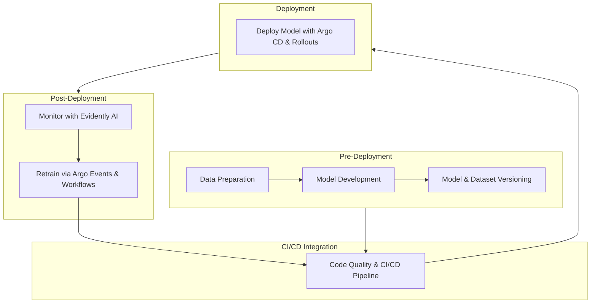

```mermaid
flowchart TD
    subgraph Pre-Deployment
        DP["Data Preparation"]
        MD["Model Development"]
        MV["Model & Dataset Versioning"]
        DP --> MD --> MV
    end

    subgraph CI/CD Integration
        CI["Code Quality & CI/CD Pipeline"]
    end

    subgraph Deployment
        DE["Deploy Model with Argo CD & Rollouts"]
    end

    subgraph Post-Deployment
        MT["Monitor with Evidently AI"]
        RT["Retrain via Argo Events & Workflows"]
        MT --> RT
    end

    Pre-Deployment --> CI --> Deployment --> Post-Deployment
    RT --> CI

```
# mlops_demo
